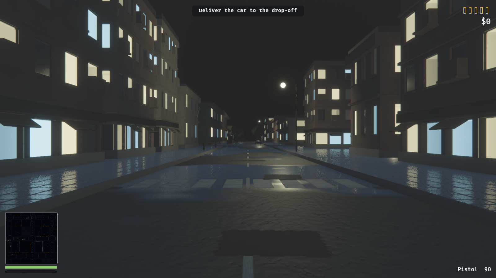
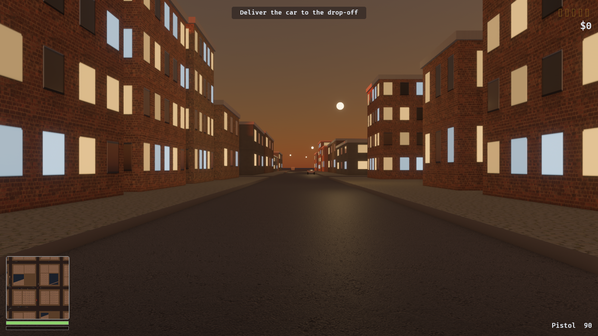

# Officer, I Can Explain

An original open-world crime sandbox, built in Rust with Bevy.

An original work, not affiliated with anyone: the city, vehicles, pedestrians
and police are all generated procedurally at runtime, and no trademarks or
third-party IP are used. The sound is synthesised at startup from a seed. The
surface materials are scanned PBR sets under CC0 — public domain — fetched by a
script and never checked in.


A 2 km² city — 676 blocks, 4046 buildings, 729 intersections — generated from a
seed in 0.3 ms. Districts, parks and the street grid all fall out of the same
generator; nothing here is authored by hand.

| | |
|---|---|
|  |  |
|  |  |
|  |  |

## Running

```sh
tools/fetch-materials.sh  # ~200 MB of CC0 textures; optional, see below
cargo run                 # first build takes a few minutes; then ~2-10s
cargo run --release       # smoother, slower to compile
cargo run --features dev  # dynamic linking, fastest iteration
```

The material download is optional. Without it every surface falls back to the
procedural texture it shipped with, and the game runs exactly the same — it
just looks worse. Nothing is checked in and nothing is required to build.

## Controls

| | |
|---|---|
| **WASD** | Move / steer |
| **Mouse** | Look |
| **Shift** | Sprint |
| **Space** | Jump on foot, handbrake in a car |
| **F** | Enter / exit vehicle |
| **Left mouse** | Fire |
| **Right mouse** | Aim — raises the crosshair, which turns red on anything that can be hurt |
| **M** | Full-screen map |
| **F1** | Free-fly debug camera (hold right mouse to look) |
| **F5 / F9** | Quick save / quick load |

Take your hand off the mouse and the camera swings itself in behind you — hard
behind a car, gently on foot, and never while you are aiming or already
steering the view yourself. Both rates are on the dev panel.

Gamepad is mapped throughout: left stick moves, right stick looks, A jumps,
Y interacts, right trigger fires, left trigger aims, B is the handbrake.

## The loop

Steal a car where somebody can see you and you pick up a wanted star. Police
are dispatched to where the crime was reported and close in on the road
network. **Heat only falls while no officer can see you** — escaping means
breaking line of sight and keeping it broken for seven seconds, not waiting out
a timer. Five stars puts eight cruisers on you, and above one star they stop
following and start ramming — which on foot means being run over, thrown, and
left on the tarmac for a second and a half.

## Layout

| Module | What lives there |
|---|---|
| `core` | States, schedule sets, tunables, deterministic RNG, screenshot tool |
| `world` | City generator, road graph, chunk streaming, day/night, weather, lights, facade shells and level of detail, window interiors, trees, street furniture, roofs, road wear, wet roads |
| `player` | Input mapping, character controller, camera rig, enter/exit |
| `vehicle` | Arcade vehicle physics, specs, damage, parked-car spawning |
| `ai` | Traffic, pedestrians, police pursuit, shared steering, walk cycles |
| `crime` | Crime kinds, witnesses, the wanted level |
| `combat` | Health, armour, hitscan weapons, being run over |
| `mission` | Objective state machine, mission chain, money |
| `ui` | HUD, minimap, crosshair, dev tuning panel |
| `save` | RON quick save / load |
| `render` | Quality presets, atmosphere, exposure, bloom, shadows, ambient occlusion, anti-aliasing, volumetrics, grading, the post stack |
| `audio` | Sound synthesis, the sound bank, and what triggers what |

The world is fully reproducible from `GameConfig::world_seed`, so a save stores
only what cannot be derived: position, money, health, heat and mission progress.

## Quality

Everything the renderer is allowed to spend is decided by one preset, resolved
in `render::quality` into a flat block of numbers that the rest of `render`
reads. Five tiers, `low` through `photo`; `high` is the default.

```sh
cargo run                        # high
cargo run -- --screenshot shots/x.png --quality ultra
```

A preset is a *request*, not a promise. At startup the GPU is asked what it
supports and the settings are walked back to fit — asking for raytracing on
hardware with no ray query falls back to screen-space reflections and ambient
occlusion, rather than to a black screen. The dev panel picks a preset live and
lets individual effects be toggled off it, which is the only way to find out
what one of them actually costs.

Raytracing and DLSS are cargo features rather than defaults, because one pulls
in acceleration-structure building and the other needs a vendor SDK:

```sh
cargo run --features raytracing
```

## Development

```sh
cargo test                                  # 279 tests
cargo clippy --all-targets -- -D warnings
cargo fmt
```

### Screenshots without a human

The renderer can be driven headlessly, which is how every milestone was
verified. It renders to an offscreen texture rather than the window, because
capturing a window the OS has not composited returns black.

```sh
cargo run -- --screenshot shots/city.png --at 0,620,900 --look 0,20,-200 \
    --stream-radius 1800 --hour 10

cargo run -- --screenshot shots/street.png --at-node 300 --eye 1.7 --hour 21.5
cargo run -- --screenshot shots/drive.png  --follow --drive --frames 2000
cargo run -- --screenshot shots/map.png    --follow --map
```

`tools/shoot.sh` renders the whole battery — aerial, street, dusk, night, rain,
dawn, overcast, facade, park, bodywork, showroom, driving, map — so a rendering change can be
judged against the last one rather than against a memory of it. `--all-presets` shoots every
tier into `shots/<preset>/`, and frame times are collected at the end, because
a screenshot says a change looks right and says nothing about whether it can be
afforded.

| Flag | Effect |
|---|---|
| `--at x,y,z` / `--look x,y,z` | Camera pose |
| `--at-node N` | Stand at road junction N, looking down the street |
| `--at-car` | Frame the nearest parked car, three-quarters on |
| `--damage F` | Beat that car up first, 0 to 1 |
| `--showroom` | Park one of every archetype in a row and shoot it |
| `--wet F` | Soak the ground, 0 to 1 |
| `--cover F` | Cloud over the city, 0 to 1; above about seven tenths it rains |
| `--eye H` | Eye height for `--at-node` |
| `--follow` | Use the real third-person camera |
| `--drive` | Take the nearest car and drive it (also logs telemetry) |
| `--map` | Open the full-screen map |
| `--hour H` | Freeze the clock at hour H, and the weather with it |
| `--stream-radius M` | Load more of the city than a player would |
| `--frames N` | Frames to render before capturing |
| `--quality Q` | Renderer tier: `low`, `medium`, `high`, `ultra`, `photo` |
| `--fps-log` | Log median, p95 and worst frame time alongside the shot |

## Textures

Surfaces come from photogrammetry: `tools/fetch-materials.sh` pulls ten scanned
PBR sets from [ambientCG](https://ambientcg.com), all released under CC0, into
`assets/materials/`. `world::material` loads them — colour through sRGB, the
rest linear — builds each one a mip chain on the CPU, because Bevy has no
runtime mip generator and a 2K texture tiled across a road without one does not
shimmer so much as boil, and hands them a tiling anisotropic sampler.

Anything missing falls back. Every lookup returns an `Option` and the caller
paints its own; a fresh clone with no download still starts.

Structure stays procedural, because no scan can supply it. Every material is
painted into an `Image` at startup by `world::texture` —
value noise, fBm and ridged noise, plus a few deliberate shapes. Facades are
the interesting case: the window grid is drawn per building class (house,
low-rise, mid-rise, tower) so a tower gets curtain-wall glazing and a house
gets four panes and a door, rather than one texture stretched over both.

Each facade produces four maps from one pass — colour, a metallic-roughness
pack so the glass is glossy and the wall is not, a tangent-space normal map so
the panes are genuinely recessed, and an emissive mask marking which windows
are lit. `timeofday` ramps the emissive strength, which is why the city fills
with light at dusk without a single extra light source.

Facades get both. The painted texture holds what is *about* the building —
where the windows are, which are lit, where the floor lines fall — and a
scanned brick or concrete grain is sampled on top of it in **world space**,
through `assets/shaders/facade.wgsl`. Sampling in world space rather than in
the mesh's UV is what makes it work: the grain's scale belongs to the world, so
a two-storey house and a forty-storey tower share one material. Anchoring it to
the building instead would need a size bucket per material and take the city
from twenty-odd draw calls to several hundred.

Variety comes from combination rather than from count. Each district names four
walls — a residential street is brick, brick, older brick and render; an
industrial one is concrete with brick warehouses in it — and each is then
dressed at a different scale, with half turned a quarter turn. Scale is the
strongest lever, because what the eye measures is the course height against the
storey. All of it lands in a material that had to exist anyway, so the city's
material count does not move.

The shader picks one projection rather than blending three. Every wall in this
city stands on the street grid, so the dominant axis of the normal *is* the
plane the wall lies in — there is no diagonal face for a triplanar blend's
seams to show up on. Glass is masked out by metalness, which the facade's own
surface map already carries.

## People

A pedestrian was a capsule, which reads as a person at fifty metres and as a
bollard at five — and five metres is where pedestrians matter, because they are
the witnesses, the victims and the crowd that scatters when a car mounts the
kerb. They are now figures: torso, head, two arms, two legs, hung off the same
entity the capsule collider is still on. Nothing about the physics or the
line-of-sight checks changed.

Limbs pivot at the joint rather than at their centre, which is why each is an
entity at the shoulder or hip with its mesh hung below it — rotating a centred
capsule swings it about its middle, and a leg that does that is not walking.
The stride is paced by distance covered rather than by time, so running takes
faster steps instead of longer ones. The player wears the same figure.

## Roofs

A building was two boxes: a wall and a capping slab. From the pavement that is
nearly enough, because you cannot see a roof from the pavement. From anywhere
with height it was the most damning view in the game — four thousand identical
white rectangles, a circuit board rather than a skyline.

Two levers, kept separate because they cost completely different things. The
**parapet varies per building** — height and overhang drawn from the building's
own seed. That is free, because the slab was already an entity with its own
transform, and it is the half that still reads from a kilometre up where an
air-conditioning unit is a fraction of a pixel. **Clutter sits on the deck** —
plant, extract stacks, water tanks, the stair head that had to surface
somewhere, an aerial nobody took down. That costs a draw call each, so it
carries a visibility range and stops being drawn well before it stops being
resolvable.

Placement is a coarse grid with jitter inside each cell, sampled without
replacement. Two pieces cannot occupy the same volume whatever the RNG does,
and it terminates in a fixed number of steps rather than in however many tries
overlap-testing needs. The seed comes from the footprint rather than from a
spawn counter, because chunks regenerate whenever the player walks back into
them and a counter would re-roll a different roof each time.

## Facades

Every building was a scaled cube with a facade painted onto it. That carries
further than it sounds — the normal map bevels the panes, the grain shader gives
the wall a material — but it fails in exactly the situation the player is in
most of the time: standing on a pavement looking *along* a street. At a glancing
angle a painted reveal has no parallax and no silhouette, so every window in the
row lies in one plane and the eye reads the whole street as a poster.

So the near wall is geometry: panes set back behind the wall with jambs around
them, sills, string courses at the floor lines, a cornice at the top, a sign
board over the shopfronts with awnings under it, and balconies on the kinds of
building that would have them.

**There is not a single metre in `world::shell`.** A reveal is a fraction of a
*bay*, a course is a fraction of a *storey*, and both come out of the same
`FacadeClass` grid that `world::texture` paints the windows on — one description
of the window grid, read twice, so the reveals cannot land beside the glass. It
is also the whole reason one mesh serves four thousand buildings: the shell is
built in unit-cube space and scaled by the building's own transform, so a length
baked into it comes out multiplied by whatever that building happens to measure.
A twelve-centimetre reveal on a house would be half a metre on a tower.
Expressed as a fraction of a bay it survives the scaling, because a bay is
scaled by the same number.

Anything standing proud of the wall — a sill, a balcony, an awning, the
underside of the cornice — is coloured from a rectangle of facade that is known
to be masonry, not from where it happens to stand. A balcony parapet hangs
across the lower half of its own window, and sampled by position it comes out
glazed: a second pane floating half a metre in front of the real one and
displaced from it by its own parallax. The awning gets the shopfront's sign
board, which is what a real one carries anyway.

Sixteen meshes cover the city: four height classes, two levels of detail, two
variants. Two variants rather than one because a residential street is a row of
buildings of the same class, and a single pattern would put every balcony in it
on the same bay of the same floor.

| Level | Out to | What it is |
|---|---|---|
| LOD0 | 80 m | Reveals, jambs, sills, balconies, awnings, every course |
| LOD1 | 250 m | The horizontal courses only |
| LOD2 | beyond | The plain box, and the collider |

All three levels carry the same transform and measure from the entity's origin
rather than from a bounding box, so all three measure the *same* distance and
hand over on precisely the same metre — which is what Bevy needs before it will
dither one into the next instead of blinking between them. The facade shader
calls `visibility_range_dither` itself; a custom fragment shader that forgets to
is how a crossfade becomes two solid buildings in the same place.

Shadow casting follows the chain rather than sitting on one level of it, because
Bevy's directional-light visibility honours the same ranges the camera does: a
level culled by distance casts nothing.

The distances are multiplied by the preset's `lod_scale`, and then clamped. The
clamp is a resolution argument rather than a frame budget — at 1440p across a
sixty-degree field a pixel subtends about four ten-thousandths of a radian, so a
two-hundred-millimetre reveal is one pixel wide at five hundred metres and less
than one beyond it. Photo mode is entitled never to drop detail it could see;
that is where it stops being the same sentence.

## Windows

Geometry got the reveal right and left the pane wrong. A window was a flat
colour behind a frame, and a flat colour is the one thing a window is not: what
says *room* is that whatever is behind the glass moves against the frame as you
walk past, and stops when you stop.

So the facade shader follows the view ray into a box behind the glass and shades
whichever of its five surfaces the ray lands on — interior mapping, which is
parallax mapping with a room instead of a height field. No geometry behind the
pane, no second draw, no texture: one ray against six planes, on the fragments
the metallic channel already marks as glass.

Two things it needs to know and had no way to:

* **Where the pane sits in its cell.** It is handed the same `FacadeClass::pane`
  rectangle that `world::texture` painted the glass from and `world::shell` cut
  the reveal from — a third reader of the one description of the window grid,
  rather than a third copy of the numbers.
* **How big the pane is in metres.** One material is shared by every building in
  a district and no two of them are the same size, so nothing in the material
  knows. It is recovered per fragment instead: a wall is planar, so its world
  position is an affine function of its UV, and the screen-space derivatives of
  the two are a two-by-two system whose solution is how many metres a whole
  building face measures. A shopfront then gets a shop-sized room and a bathroom
  window a bathroom-sized one, out of the same uniform.

A third of them have blinds down, which is the cheapest variety there is: a room
you cannot see into still reads as a room, and it reads as a different one from
the room next to it.

The glass stopped being a metal to pay for this. It was one — `metallic 0.55` —
because a metal reflects, and reflecting was the only way to get anything at all
into a window. With a room behind it that trade runs backwards: a metal's base
colour tints its reflection instead of showing through it, so the room would
have come out as a coloured mirror. As a dielectric the glass shows the room
straight on and still mirrors the street at a glancing angle, which is the angle
a window actually reflects anything at.

Lit windows keep the parallax after dark, because the emissive is scaled by the
same surface the ray landed on: a lit room's back wall is brighter than its side
walls, and the two slide against each other as the camera moves.

## Wear

The asphalt is one plane two kilometres across, and its texture is painted
before the street layout exists — so nothing in it can know where a junction is,
where cars stop, or which way the water runs. Manholes, gullies, repairs, oil,
cracks and rubber are laid on top of it afterwards, as forward decals: a quad
that reads the depth prepass, finds the surface actually underneath it, and
projects itself onto that.

That is the difference between `world::decals` and `world::markings` next door,
and the reason they are not the same code. A road marking is an alpha-masked
quad floating a centimetre and a half above the asphalt, and it gets away with
that because paint really is a flat sheet lying on top of a road. A manhole
cover is not: it sits *in* a surface that falls away towards its gutters.

The wear is in the placement rather than in the images:

| | Where |
|---|---|
| Manholes | one line down each street, at the spacing an access chamber is built at |
| Gullies | in the gutter, against both kerbs |
| Patches, cracks, stains | counted per hundred metres, scattered across the carriageway |
| Rubber | on the approach to a junction, in the lane the traffic drives in |
| Oil | where a car waits at that junction |

Two things it costs. A decal draws with its depth test off — that is what lets
it paint a surface that is not exactly where its own quad is — so the only thing
keeping a stain off the roof of the car parked over it is the distance over
which it fades out, which is thirty centimetres. And decals are blended, so they
are sorted, unlike everything else in the city.

Which is what the hundred and thirty metre draw distance is for, and it is what
pays for the density. A street that has been dug up twice and driven over for
twenty years is not a clean sheet with three marks on it, so there are a lot of
these — but a manhole cover is 700mm across, and past a hundred and something
metres it is one pixel that still has to be sorted against every other one. The
count that makes a road look driven on is only affordable if nearly all of it is
never drawn. Like everything else with a range, it scales with the preset.

The failure this technique is prone to is invisible from head height. The
projection pushes a decal's UV outside its own image as the view flattens, and
the sampler clamps rather than wraps, so whatever is in the edge texel gets
dragged across the road for as far as the projection reaches. Every decal is
painted with an exactly transparent border, and a test reads the pixels back to
say so — "nearly zero" is a smear that is nearly there.

## Trees

There was not one. A park was a green rectangle and a residential street was two
rows of boxes with a bin between them.

A tree is two entities: a trunk whose mesh is translated so that the entity's
origin sits on the ground, and one crown as its child. The crown is several
blobs merged into a single mesh at build time — three offset ones for a plane
tree, three stacked for a poplar — because the silhouette is the entire
difference between the species as far as anyone on the pavement can tell, and
merging costs nothing once, per species, at startup.

The trunk pivoting at its foot is what lets the wind work. `Weather::wind`
drives a rotation about the axis perpendicular to it, and the crown comes along
because it is a child: no vertex animation, no custom material. Two sine
frequencies rather than one, because a street of metronomes in step is worse
than no movement at all, and the cycle runs from a third of the lean to all of
it rather than through zero — a gust adds to a lean, it does not reverse it.

How far each species gives is checked against the cantilever it is. Tip
deflection goes as length cubed over the fourth power of the trunk's radius, so
a poplar bends further than a cherry despite the thicker trunk, because it is
twice the height.

Only what the camera can see sways. That is not an optimisation of the maths —
the maths is four sines — but of the *write*: touching `Transform` queues an
entity for transform propagation and a fresh upload of its instance data, and
there are thousands of these standing in chunks nobody is looking at.

A street is either an avenue or it is not, decided once per street rather than
per tree, and it is planted with one species — a row of trees goes in at once,
by one council, from one nursery. Parks get a jittered grid, a clipped hedge
round the edge, and a gap in the middle of each side to walk in through.

Street furniture roughly doubled at the same time: parking meters, benches,
newspaper boxes, planters, phone boxes. Junctions with three or more arms, at
least one of them arterial, get a signal on each approach.

## Deferred

The opaque pass writes a g-buffer rather than shading in place, at every quality
tier. Not a setting, even though only the upper ones strictly need it: which
pipeline a material compiles for is settled when the material is prepared, so
flipping it at runtime leaves already-specialised pipelines behind and geometry
disappears — and a city lit by sixty-four street lamps and a pair of headlights
is the case deferred shading exists for.

Two things follow. Screen-space reflections become possible at all, which is
what puts the lit windows into the wet road. And every material that shades
opaquely needs a deferred path of its own: the facade and the road both branch
on `PREPASS_PIPELINE` inside one shader file rather than keeping a second copy,
because the grain projection and the puddle mask are subtle enough that two
copies would drift. A material with only a forward shader is not an error — it
silently writes its base texture into the g-buffer and loses everything the
extension was for.

The cost is that every camera drawing the world needs a g-buffer to draw into. A
deferred material is skipped outright by the forward opaque pass rather than
falling back to it, so the minimap gets one too — at 320 by 320 that is nothing,
and the alternative is keeping a second renderer path alive for one widget.

## Shadows

Shadows were the largest single thing wrong with the picture, and none of it
was subtle once you knew to look. They **stopped at 150 metres**, because
nothing ever configured the cascades and Bevy's default is a distance chosen
for a game in a room — in a city streamed out to nine hundred, the far half of
the skyline was lit from every direction at once. Nothing was **planted**: a
shadow map texel covering half a metre cannot resolve the gap between a bollard
and the pavement it stands on, so the bollard floated, and so did every wheel
and every lamp post. And every edge was **equally hard**, whether cast by a
parapet forty metres up or by a wing mirror ten centimetres off a door.

Three fixes, deliberately different in kind. The cascade split is *geometry* —
it decides which distances are shadow-mapped at all, and it is now derived from
the streaming radius, because shadowing a building that was never spawned costs
resolution and buys an empty map. Contact shadows are a *screen-space* pass
that puts back the short dark contact no shadow map resolution can afford.
Soft shadows are *filtering*: the penumbra widens with distance from the
caster, the way a real one does.

The shadow filter follows the upscaling setting rather than the quality tier.
`Temporal` varies its sample pattern between frames and is only good *because*
something resolves that variation afterwards; with no temporal pass it is
noise.

## Air

Everything else in this renderer is about surfaces: what the light does when it
lands on something. Volumetric fog is about the space in between — the shaft
that comes down a side street when the sun is low, the cone standing under a
street lamp at night, the way a city thickens up in rain. It is the most
recognisable "expensive renderer" marker there is, and also the one that most
needs restraint: fog dense enough to be obvious is fog dense enough to eat the
city.

Three pieces have to be present together or none of it happens: a
`VolumetricFog` on the camera to run the raymarch, a `FogVolume` in the world
saying *where* the air is, and a `VolumetricLight` on every light allowed to
shine through it. Not all of them — the cost is per light per raymarch step. The
sun comes in as soon as there is any fog at all, because it is one light and it
is the one that makes the shafts; the sixty-four street lamps come in only at
the top tier, and that is where the tier boundary is.

Density is per metre and the march attenuates by `exp(-distance × density ×
0.6)`. Bevy's default of 0.1 fogs a surface out completely inside a hundred
metres, which is the right number for a room and three orders of magnitude wrong
for a city, so everything here is in thousandths. That thin air is also why the
volume's light term is driven above one: in-scattered brightness scales with
density, so air thin enough to see a city through is too thin to show a shaft
honestly. Nudging the light rather than the density buys the shafts without the
soup, and it fades back towards honest as real weather thickens the air.

Two things about the box turned out to matter more than anything in the shader.
It is a **layer**, seventy metres deep, not a column tall enough to clear
downtown — fog *is* a ground layer, a tower standing out of the top of one is
something you can photograph, and the shorter the box the less of it a skyward
ray crosses, which is what caps the density. Bringing the ceiling down to a
plausible fog depth bought back most of a factor of three. And it **follows the
camera at a couple of hundred metres**, not the streamed city, because Bevy dims
every light's contribution by `exp(-density × bounding_radius × 0.6)` where the
radius is the volume's own half-diagonal: sized to the city, that radius dimmed a
clear night's lamp cones by four and a rainstorm's by seven hundred. A bigger
volume with less visible fog in it is the trap this module is built around.

## Grade

A day/night cycle in real units gets the *brightness* of an hour right and says
nothing about its colour. Six in the morning and six in the evening are the same
sun at the same angle, and they do not look alike; what separates them is
grading, and it is most of what people mean by a game looking cinematic. Warmth
is pushed past the physical answer while the sun is low and still up, pulled
cold through the small hours where sodium is the only warm light left, and
pulled cold again by cloud at any hour. Saturation comes down with cover and
with darkness, because past dusk the eye is running on rods and has hardly any
colour vision left — a fully saturated night is the single most common thing
that makes a game look like a game.

Auto exposure runs on top of that, and is deliberately not allowed to do its
whole job. Metering the frame to middle grey would hand back the five stops
between noon and midnight that the physical lighting model exists to earn, and
night would come out as a slightly blue afternoon. But the histogram knows one
thing the clock cannot: where the camera is pointed — into a shadowed courtyard,
at a lit shopfront, down a black alley. So it is given partial authority instead
of none, through a compensation curve that is a straight line of slope 0.72.
Bevy computes `target = compensation(measured) − measured`, so a line of that
slope anchored at a correctly exposed frame corrects by roughly a third of a
stop for every stop the frame is away from one: a dark courtyard lifts, and a
night stays a night.

Motion blur is a half-open shutter, which is the cinema convention and the most
a 60fps frame can smear without stretching an object further than it actually
travelled. Depth of field pulls focus by casting one ray down the view axis and
focusing on what it hits, racked over about a third of a second rather than
snapped — a fixed focal distance would be worse than none at all, since it would
blur the car in a showroom shot and sharpen the wall behind it.

Lens distortion is the one effect in the stack deliberately left out. A
barrel-distorted frame is a real photographic artefact and the wrong one here: a
city is made of straight lines meeting at right angles, and bending them at the
edge of the frame does not read as a lens, it reads as a mistake.

## Weather

Three values, and only one of them is remembered. **Cloud cover** is sampled from
a slow noise over the world clock, so the sky changes on its own and changes the
same way on every run of the same seed. **Rainfall** falls out of cover — a clear
sky does not rain, and it takes a nearly solid overcast before it does.
**Wetness** is the state: it soaks up under rain and dries off in sun and wind,
which is why a street stays glossy for a while after a shower and why the
reflections outlast the streaks.

All three move on *game* hours rather than wall-clock seconds, so freezing the
clock freezes the weather with it. That is the whole reproducibility story:
`--hour` already stopped the sun, and now it stops the sky as well.

What cover then *does* is spread across the modules that own each surface rather
than centralised in one place. The direct beam falls away and the skylight
replacing it climbs, so an overcast city goes flat rather than dark; the warmth
goes out of a low sun, so a sunset under solid cloud is grey; the shadow penumbra
widens, because an overcast sky is one enormous area light; the air thickens and
the haze closes in; the grade cools and flattens; and the city's windows come on
for a dark afternoon, because they are wired to how bright it is outside rather
than to the clock.

Rain itself is two things, and the second is the one that matters. Falling rain
is a few thousand streaks kept in a box around the camera, wrapped rather than
respawned, and leaning into the wind. *Wet ground* is what changes the picture:
soaked asphalt goes darker
and far glossier, and at the grazing angles a street is actually seen from it
stops being a surface and starts being a mirror for the sky and every lit window
above it.

Part of that mirror comes free — the camera already carries an environment map
generated from the atmosphere, so dropping a surface's roughness is enough to
reflect the sky. The rest is screen-space reflections, which read a g-buffer and
so were impossible while the renderer was forward. It is deferred now, and the
road reflects the lit windows above it rather than only the sky.

Rain also puddles, which is the half a single wetness number cannot express. A
road that goes uniformly glossy reads as varnish; a real one holds water in its
dips and stays damp matte between them. The mask has to be computed in world
space, because the road is one quad forty kilometres across with its UVs
multiplied by about six thousand — anything sampled in UV repeats every six
metres, and puddles on a six-metre grid are a pattern rather than weather.

Standing water also *flattens* what it lies in. Dropping the roughness without
flattening the asphalt's own normal map leaves every grain of chipping throwing
its own highlight off a near-mirror, and the road comes out glittering like
crushed glass. Damp asphalt keeps its texture; a puddle does not have one.

Both halves of the weather can still be taken over by hand — `--wet` and
`--cover` on the command line, sliders in the dev panel — because the
interesting states take game hours to arrive on their own and nobody tuning the
look of rain is going to wait for one.

## Vehicles

Bodywork is lofted: each archetype is a handful of cross-sections along the
car's length — where the bonnet drops, how far the screen is raked, how much of
the length the cabin takes — skinned into a mesh. A silhouette is what makes a
vehicle recognisable, and that makes it a table of numbers per archetype rather
than a modelling job. Sections are normalised and scaled by the spec's
half-extents, so resizing a car reshapes its body without redrawing it.

The shapes are archetypes, not reproductions: a saloon, a long-bonnet coupé, a
mid-engined wedge, a pickup, a box van and a cruiser. Copying a real car's lines
would mean copying design its manufacturer protects, and an archetype reads
faster anyway — it is the idea of the car rather than one example of it.

Each archetype carries a beltline: above a stated height the shell steps in by
four percent, and that step is the crease line down the flank that every pressed
panel has. It has to be put there rather than found — sampled at twenty-eight
points, the sharpest corner on a saloon's cross-section is twenty-three degrees,
spread over several of them, so there is no edge in the shape to detect. The two
ring points straddling the belt are pinned to it, which turns the step into a
right angle no amount of tessellation can soften, and `split_creases` then
duplicates the vertices along it so smoothing stops averaging across the fold.

Wheels are surfaces of revolution with the tread and the spokes painted on and
normal-mapped rather than modelled — geometry that fine is a blur above walking
pace.

Paint comes from a weighted palette: mostly white, silver, grey and black, with
the occasional colour, because an evenly sampled rainbow reads as a toy box and
it is the proportion of dull cars that makes the red one feel deliberate. Each
colour carries its own flake content, and it goes on under a clearcoat.

Crashes beat the metal in. The first real impact copies that car's panels off
the archetype's shared mesh — everything else keeps batching — and pushes a
dent into them along the direction the blow arrived from. The lacquer dulls, the
flake stops reading, and past about a third gone the colour cooks off towards
soot; below thirty percent it smokes.

## Audio

There are no sound files either. `audio::synth` is a small DSP kit — partials,
noise, one-pole filters, resonators, envelopes — and `audio::bank` writes every
sound in the game as an expression in it: a gunshot is a crack plus a muzzle
blast plus the street answering back. The buffers are computed once at startup
and played through a custom Bevy audio source.

Loops are built to be seamless by construction rather than by crossfading: the
engine and the ambience are sums of harmonics of the loop frequency, so the
waveform is exactly periodic, and the siren's sweep is tuned so its accumulated
phase closes at the loop point.

Engine pitch follows the drivetrain, sirens and beacons come on with the
pursuit, and everything but the player's own car is positioned in the world.

## Known limitations

- The sky itself has no clouds in it. Bevy's atmosphere is a scattering model, so
  cover is expressed entirely through the light — dimmer, flatter, cooler,
  hazier, no hard shadows — and the dome overhead stays blue however hard it is
  raining. Everything the weather does is right; the thing you would photograph
  it against is not.

- Cloud shadows do not move across the city. Cover dims the sun everywhere at
  once, which is exactly right for a solid overcast and wrong for broken cloud on
  a windy day. A real one needs the pattern projected into the light, not a
  multiplier on it.

- God rays are still soft. The air lights up towards a low sun and goes dark
  away from it, which is the physics working; a *shaft* additionally needs a
  hard-edged gap in an occluder. There are cornices, balconies and street trees
  to cast them now, where before there was nothing but boxes on a grid — but the
  fog is sampled too coarsely to resolve a gap the width of a balcony, so what
  comes out is a brighter haze rather than a beam.

- The volumetric fog is one box that follows the camera, so from far enough away
  the air stops. Anything past it is hazed by the atmosphere's aerial
  perspective and the distance fog instead, which is a different model with a
  different look; the seam is soft, but it is there.

- The 60 fps at 1440p budget is unverified. Everything in `shots/` was rendered
  on a software rasteriser, where a frame takes seconds and the frame times say
  nothing whatever about a GPU. The geometry here was sized against a resolution
  argument — a reveal is under a pixel past five hundred metres — rather than
  against a measurement. The measurement is still owed.

- Meshlets are not built. GPU cluster culling is the right technique for the
  LOD0 shells and it is what a modern engine would carry this geometry with; it
  needs an offline `MeshletMesh` conversion and a material pipeline of its own,
  and there is no way to demonstrate the win from here.

- The window grid is a count, not a size. A class fixes how many windows a wall
  has — three for a house, nine for a tower — so a wide industrial shed gets
  three bays across twenty-three metres and an eight-metre bay with it. The
  shell follows the texture exactly, so it inherits this rather than fixing it.

- A reveal is cut into the wall by a fraction of a bay, and the wall's depth
  axis is scaled by the footprint's *other* side. A building twice as deep as it
  is wide has reveals twice as deep on its short faces. Lots are subdivided by
  always splitting the longer side, so the error stays under a factor of two.

- Trees lean, they do not flutter. A rigid rotation about the foot is honest for
  a swaying trunk and says nothing at all about leaves, and above a gale the
  model stops rather than pretending — a tree thrashing in a storm is not
  something one rotation can portray.

- Traffic signals are unlit and nothing obeys them. A crossroads showing green
  down every arm at once would be a clearer lie than one showing nothing.

- Every room behind a window is the same shape: an empty box as deep as its own
  window is wide. It is the silhouette of the opening that varies, not what is
  in the room, so a shopfront and a bedroom differ in size and colour and in
  nothing else. Furniture would need a second box test per fragment and a reason
  to believe anybody would look.

- Screen-space reflections can only reflect what is on screen. A car just out of
  frame stops appearing in the road under it. Light probes do not have that
  problem and cannot reflect anything that moves; the two are complementary and
  only one of them is built.

- Pedestrians cross roads wherever their route turns, rather than at crossings.
- Traffic has no right-of-way rules at junctions; it brakes for obstacles only —
  the signals above are the visible half of a rule that is not implemented.
- Vehicle damage is not visually modelled — cars are wrecked, not deformed.
- Facades are procedural, so walls read as materials rather than photographs.
  Scanning them needs a custom material with a detail UV; see above.
- Six wall sets across five districts, so a long enough walk repeats. What
  breaks the repeat is combination, not count — see above. More sets is the
  obvious fix and is not done, because ambientCG is not reachable from where
  this was built; adding set names that cannot be fetched would put a manifest
  in the tree that nobody has ever seen resolve.

- Parallax mapping is deliberately not wired, though the displacement maps are
  downloaded. It was measured rather than skipped: on the pavement the joints
  are twelve millimetres across a two-and-a-half-metre texture repeat, so the
  offset is under half a percent of one and invisible next to what the normal
  map already does. On a facade the depth map would displace the very UV the
  window grid is painted in, and a reveal would arrive with its window sliding
  out of its own hole — that surface got real geometry instead. The one place
  the technique genuinely pays here is behind the glass, and that is what
  `glaze` is.
- Damage does not change how a car collides: dents move metal, never the box
  the physics uses. Rebuilding a convex hull per impact is the alternative.

