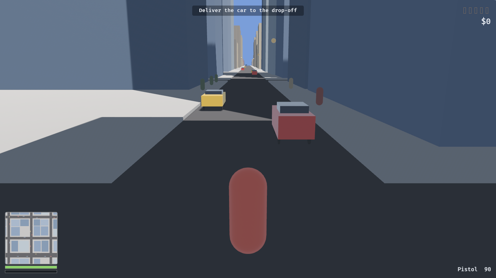

# Officer, I Can Explain

An original open-world crime sandbox, built in Rust with Bevy.

An original work, not affiliated with anyone: the city, vehicles, pedestrians
and police are all generated procedurally at runtime, and no third-party
assets, trademarks or IP are used.


A 2 km² city — 676 blocks, 4046 buildings, 729 intersections — generated from a
seed in 0.3 ms. Districts, parks and the street grid all fall out of the same
generator; nothing here is authored by hand.

| | |
|---|---|
|  |  |
|  |  |

## Running

```sh
cargo run                 # first build takes a few minutes; then ~2-10s
cargo run --release       # smoother, slower to compile
cargo run --features dev  # dynamic linking, fastest iteration
```

## Controls

| | |
|---|---|
| **WASD** | Move / steer |
| **Mouse** | Look |
| **Shift** | Sprint |
| **Space** | Jump on foot, handbrake in a car |
| **F** | Enter / exit vehicle |
| **Left mouse** | Fire |
| **M** | Full-screen map |
| **F1** | Free-fly debug camera (hold right mouse to look) |
| **F5 / F9** | Quick save / quick load |

Gamepad is mapped throughout: left stick moves, right stick looks, A jumps,
Y interacts, right trigger fires, B is the handbrake.

## The loop

Steal a car where somebody can see you and you pick up a wanted star. Police
are dispatched to where the crime was reported and close in on the road
network. **Heat only falls while no officer can see you** — escaping means
breaking line of sight and keeping it broken for seven seconds, not waiting out
a timer. Five stars puts eight cruisers on you, and above one star they stop
following and start ramming.

## Layout

| Module | What lives there |
|---|---|
| `core` | States, schedule sets, tunables, deterministic RNG, screenshot tool |
| `world` | City generator, road graph, chunk streaming, day/night, street lights |
| `player` | Input mapping, character controller, camera rig, enter/exit |
| `vehicle` | Arcade vehicle physics, specs, damage, parked-car spawning |
| `ai` | Traffic, pedestrians, police pursuit, shared steering |
| `crime` | Crime kinds, witnesses, the wanted level |
| `combat` | Health, armour, hitscan weapons |
| `mission` | Objective state machine, mission chain, money |
| `ui` | HUD, minimap, dev tuning panel |
| `save` | RON quick save / load |

The world is fully reproducible from `GameConfig::world_seed`, so a save stores
only what cannot be derived: position, money, health, heat and mission progress.

## Development

```sh
cargo test                                  # 87 tests
cargo clippy --all-targets -- -D warnings
cargo fmt
```

### Screenshots without a human

The renderer can be driven headlessly, which is how every milestone was
verified. It renders to an offscreen texture rather than the window, because
capturing a window the OS has not composited returns black.

```sh
cargo run -- --screenshot shots/city.png --at 0,620,900 --look 0,20,-200 \
    --stream-radius 1800 --hour 10

cargo run -- --screenshot shots/street.png --at-node 300 --eye 1.7 --hour 21.5
cargo run -- --screenshot shots/drive.png  --follow --drive --frames 2000
cargo run -- --screenshot shots/map.png    --follow --map
```

| Flag | Effect |
|---|---|
| `--at x,y,z` / `--look x,y,z` | Camera pose |
| `--at-node N` | Stand at road junction N, looking down the street |
| `--eye H` | Eye height for `--at-node` |
| `--follow` | Use the real third-person camera |
| `--drive` | Take the nearest car and drive it (also logs telemetry) |
| `--map` | Open the full-screen map |
| `--hour H` | Freeze the clock at hour H |
| `--stream-radius M` | Load more of the city than a player would |
| `--frames N` | Frames to render before capturing |

## Known limitations

- Pedestrians cross roads wherever their route turns, rather than at crossings.
- Traffic has no right-of-way rules at junctions; it brakes for obstacles only.
- Vehicle damage is not visually modelled — cars are wrecked, not deformed.
- No audio yet.
