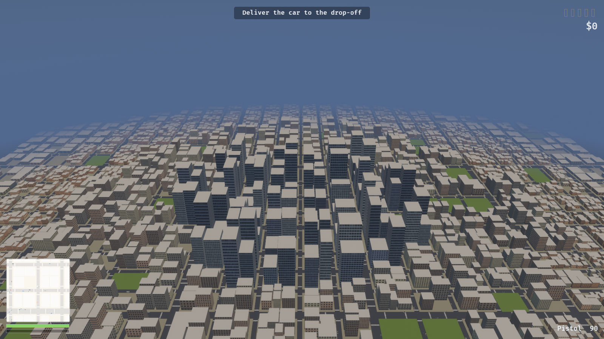
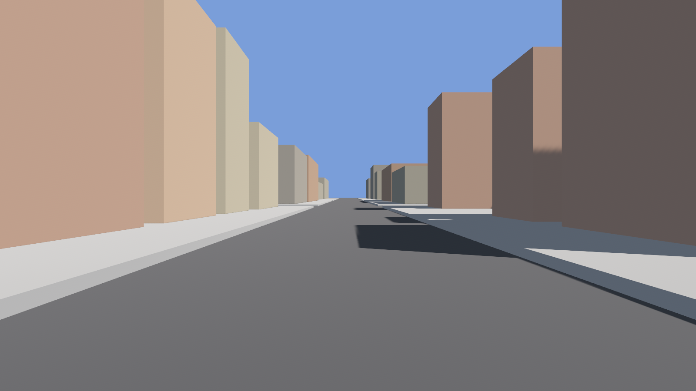
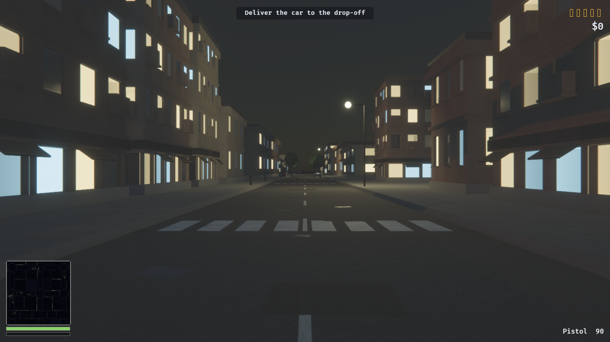
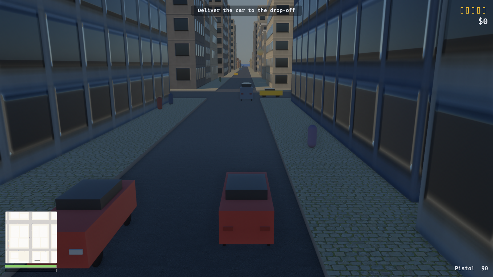
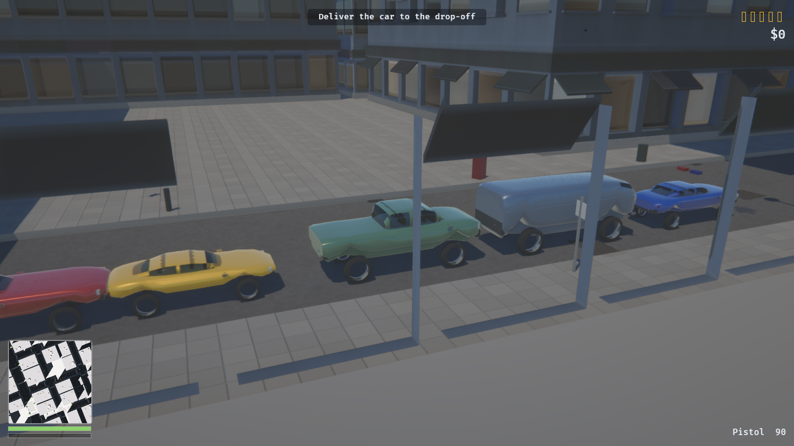

# Officer, I Can Explain

An original open-world crime sandbox, built in Rust with Bevy.

An original work, not affiliated with anyone: the city, vehicles, pedestrians
and police are all generated procedurally at runtime, and no trademarks or
third-party IP are used. The sound is synthesised at startup from a seed. The
surface materials are scanned PBR sets under CC0 — public domain — fetched by a
script and never checked in.



A 2 km² city — 676 blocks, 4046 buildings, 729 intersections — generated from a
seed in 0.3 ms. Districts, parks and the street grid all fall out of the same
generator; nothing here is authored by hand.

| | |
|---|---|
|  |  |
|  |  |

## Running

```sh
tools/fetch-materials.sh  # ~200 MB of CC0 textures; optional, see below
cargo run                 # first build takes a few minutes; then ~2-10s
cargo run --release       # smoother, slower to compile
cargo run --features dev  # dynamic linking, fastest iteration
```

The material download is optional. Without it every surface falls back to the
procedural texture it shipped with, and the game runs exactly the same — it
just looks worse. Nothing is checked in and nothing is required to build.

## Controls

| | |
|---|---|
| **WASD** | Move / steer |
| **Mouse** | Look |
| **Shift** | Sprint |
| **Space** | Jump on foot, handbrake in a car |
| **F** | Enter / exit vehicle |
| **Left mouse** | Fire |
| **M** | Full-screen map |
| **F1** | Free-fly debug camera (hold right mouse to look) |
| **F5 / F9** | Quick save / quick load |

Gamepad is mapped throughout: left stick moves, right stick looks, A jumps,
Y interacts, right trigger fires, B is the handbrake.

## The loop

Steal a car where somebody can see you and you pick up a wanted star. Police
are dispatched to where the crime was reported and close in on the road
network. **Heat only falls while no officer can see you** — escaping means
breaking line of sight and keeping it broken for seven seconds, not waiting out
a timer. Five stars puts eight cruisers on you, and above one star they stop
following and start ramming.

## Layout

| Module | What lives there |
|---|---|
| `core` | States, schedule sets, tunables, deterministic RNG, screenshot tool |
| `world` | City generator, road graph, chunk streaming, day/night, lights, street furniture |
| `player` | Input mapping, character controller, camera rig, enter/exit |
| `vehicle` | Arcade vehicle physics, specs, damage, parked-car spawning |
| `ai` | Traffic, pedestrians, police pursuit, shared steering |
| `crime` | Crime kinds, witnesses, the wanted level |
| `combat` | Health, armour, hitscan weapons |
| `mission` | Objective state machine, mission chain, money |
| `ui` | HUD, minimap, dev tuning panel |
| `save` | RON quick save / load |
| `render` | Atmosphere, exposure, bloom, ambient occlusion, anti-aliasing |
| `audio` | Sound synthesis, the sound bank, and what triggers what |

The world is fully reproducible from `GameConfig::world_seed`, so a save stores
only what cannot be derived: position, money, health, heat and mission progress.

## Development

```sh
cargo test                                  # 87 tests
cargo clippy --all-targets -- -D warnings
cargo fmt
```

### Screenshots without a human

The renderer can be driven headlessly, which is how every milestone was
verified. It renders to an offscreen texture rather than the window, because
capturing a window the OS has not composited returns black.

```sh
cargo run -- --screenshot shots/city.png --at 0,620,900 --look 0,20,-200 \
    --stream-radius 1800 --hour 10

cargo run -- --screenshot shots/street.png --at-node 300 --eye 1.7 --hour 21.5
cargo run -- --screenshot shots/drive.png  --follow --drive --frames 2000
cargo run -- --screenshot shots/map.png    --follow --map
```

| Flag | Effect |
|---|---|
| `--at x,y,z` / `--look x,y,z` | Camera pose |
| `--at-node N` | Stand at road junction N, looking down the street |
| `--at-car` | Frame the nearest parked car, three-quarters on |
| `--damage F` | Beat that car up first, 0 to 1 |
| `--showroom` | Park one of every archetype in a row and shoot it |
| `--eye H` | Eye height for `--at-node` |
| `--follow` | Use the real third-person camera |
| `--drive` | Take the nearest car and drive it (also logs telemetry) |
| `--map` | Open the full-screen map |
| `--hour H` | Freeze the clock at hour H |
| `--stream-radius M` | Load more of the city than a player would |
| `--frames N` | Frames to render before capturing |

## Textures

Surfaces come from photogrammetry: `tools/fetch-materials.sh` pulls ten scanned
PBR sets from [ambientCG](https://ambientcg.com), all released under CC0, into
`assets/materials/`. `world::material` loads them — colour through sRGB, the
rest linear — builds each one a mip chain on the CPU, because Bevy has no
runtime mip generator and a 2K texture tiled across a road without one does not
shimmer so much as boil, and hands them a tiling anisotropic sampler.

Anything missing falls back. Every lookup returns an `Option` and the caller
paints its own; a fresh clone with no download still starts.

Structure stays procedural, because no scan can supply it. Every material is
painted into an `Image` at startup by `world::texture` —
value noise, fBm and ridged noise, plus a few deliberate shapes. Facades are
the interesting case: the window grid is drawn per building class (house,
low-rise, mid-rise, tower) so a tower gets curtain-wall glazing and a house
gets four panes and a door, rather than one texture stretched over both.

Each facade produces four maps from one pass — colour, a metallic-roughness
pack so the glass is glossy and the wall is not, a tangent-space normal map so
the panes are genuinely recessed, and an emissive mask marking which windows
are lit. `timeofday` ramps the emissive strength, which is why the city fills
with light at dusk without a single extra light source.

Facades get both. The painted texture holds what is *about* the building —
where the windows are, which are lit, where the floor lines fall — and a
scanned brick or concrete grain is sampled on top of it in **world space**,
through `assets/shaders/facade.wgsl`. Sampling in world space rather than in
the mesh's UV is what makes it work: the grain's scale belongs to the world, so
a two-storey house and a forty-storey tower share one material. Anchoring it to
the building instead would need a size bucket per material and take the city
from twenty-odd draw calls to several hundred.

Variety comes from combination rather than from count. Each district names four
walls — a residential street is brick, brick, older brick and render; an
industrial one is concrete with brick warehouses in it — and each is then
dressed at a different scale, with half turned a quarter turn. Scale is the
strongest lever, because what the eye measures is the course height against the
storey. All of it lands in a material that had to exist anyway, so the city's
material count does not move.

The shader picks one projection rather than blending three. Every wall in this
city stands on the street grid, so the dominant axis of the normal *is* the
plane the wall lies in — there is no diagonal face for a triplanar blend's
seams to show up on. Glass is masked out by metalness, which the facade's own
surface map already carries.

## Vehicles

Bodywork is lofted: each archetype is a handful of cross-sections along the
car's length — where the bonnet drops, how far the screen is raked, how much of
the length the cabin takes — skinned into a mesh. A silhouette is what makes a
vehicle recognisable, and that makes it a table of numbers per archetype rather
than a modelling job. Sections are normalised and scaled by the spec's
half-extents, so resizing a car reshapes its body without redrawing it.

The shapes are archetypes, not reproductions: a saloon, a long-bonnet coupé, a
mid-engined wedge, a pickup, a box van and a cruiser. Copying a real car's lines
would mean copying design its manufacturer protects, and an archetype reads
faster anyway — it is the idea of the car rather than one example of it.

Wheels are surfaces of revolution with the tread and the spokes painted on and
normal-mapped rather than modelled — geometry that fine is a blur above walking
pace.

Paint comes from a weighted palette: mostly white, silver, grey and black, with
the occasional colour, because an evenly sampled rainbow reads as a toy box and
it is the proportion of dull cars that makes the red one feel deliberate. Each
colour carries its own flake content, and it goes on under a clearcoat.

Crashes beat the metal in. The first real impact copies that car's panels off
the archetype's shared mesh — everything else keeps batching — and pushes a
dent into them along the direction the blow arrived from. The lacquer dulls, the
flake stops reading, and past about a third gone the colour cooks off towards
soot; below thirty percent it smokes.

## Audio

There are no sound files either. `audio::synth` is a small DSP kit — partials,
noise, one-pole filters, resonators, envelopes — and `audio::bank` writes every
sound in the game as an expression in it: a gunshot is a crack plus a muzzle
blast plus the street answering back. The buffers are computed once at startup
and played through a custom Bevy audio source.

Loops are built to be seamless by construction rather than by crossfading: the
engine and the ambience are sums of harmonics of the loop frequency, so the
waveform is exactly periodic, and the siren's sweep is tuned so its accumulated
phase closes at the loop point.

Engine pitch follows the drivetrain, sirens and beacons come on with the
pursuit, and everything but the player's own car is positioned in the world.

## Known limitations

- Pedestrians cross roads wherever their route turns, rather than at crossings.
- Traffic has no right-of-way rules at junctions; it brakes for obstacles only.
- Vehicle damage is not visually modelled — cars are wrecked, not deformed.
- Facades are procedural, so walls read as materials rather than photographs.
  Scanning them needs a custom material with a detail UV; see above.
- Bodywork has no crease lines. The cross-sections give a shoulder that turns
  quickly, which reads as one, but nothing in the mesh is a hard edge.
- Six wall sets across five districts, so a long enough walk repeats. What
  breaks the repeat is combination, not count — see above.
- Damage does not change how a car collides: dents move metal, never the box
  the physics uses. Rebuilding a convex hull per impact is the alternative.

